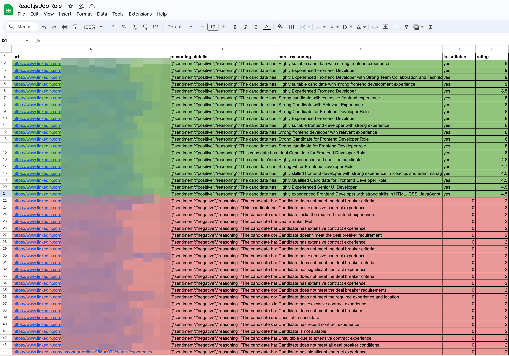

# Recruitatron 3000

He doesn't get tired, he doesn't ghost you, he doesn't make up roles... Only because I haven't written those functions yet, give him some linkedin profiles and a jobspec and he'll sort through the crap though.

### (THIS IS JUST A HACKY TIME SAVING SCRIPT, NOT A PRODUCTION READY TOOL)

Export a CSV from your DB and have fun:

